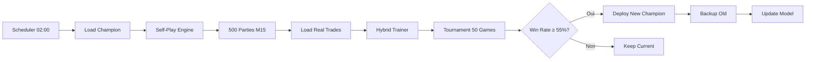

# 📚 Gemini V19 - Documentation Complète

**Version:** V19 AlphaZero Enhanced  
**Date:** Novembre 2025  
**Statut:** 🟢 Production

---

## 📋 Table des Matières

1. [Vue d'Ensemble](#vue-densemble)
2. [Architecture](#architecture)
3. [Système de Self-Play](#système-de-self-play)
4. [Configuration](#configuration)
5. [Déploiement](#déploiement)
6. [Utilisation](#utilisation)
7. [Maintenance](#maintenance)
8. [Troubleshooting](#troubleshooting)

---

## 🎯 Vue d'Ensemble

### Qu'est-ce que Gemini V19 ?

Gemini V19 est un système de trading algorithmique avancé basé sur **AlphaZero MCTS** (Monte Carlo Tree Search) avec apprentissage continu hybride. Il combine l'approche d'exploration par self-play d'AlphaZero avec l'exploitation de données réelles (stratégie MuZero).

### Caractéristiques Principales

- ✅ **11 Symboles** : Forex (5), CFD Indices (5), Crypto (1), Or (1)
- ✅ **MCTS 50 Simulations** : Décisions hautement réfléchies
- ✅ **Self-Play Nocturne** : 500 parties générées/nuit en M15
- ✅ **Training Hybride** : 60% self-play + 40% trades réels
- ✅ **Tournament Validation** : 50 parties pour valider le nouveau champion
- ✅ **Pyramiding** : Jusqu'à 3 positions additionnelles sur trades gagnants
- ✅ **Notifications Telegram** : Alertes, recaps horaires, stats 6h
- ✅ **Dashboard Rich** : Interface temps réel avec indicateurs

### Symboles Tradés

| Symbole | Type | Timeframe Live | Pyramiding |
|---------|------|----------------|------------|
| EURUSD | Forex | M5 | ✅ |
| GBPUSD | Forex | M5 | ✅ |
| USDJPY | Forex | M5 | ✅ |
| USDCAD | Forex | M5 | ✅ |
| USDCHF | Forex | M5 | ✅ |
| XAUUSD | Or | M5 | ✅ |
| BTCUSD | Crypto | M5 | ✅ |
| US30.cash | Dow Jones | M5 | ✅ |
| US500.cash | S&P 500 | M5 | ✅ |
| US100.cash | NASDAQ | M5 | ✅ |
| GER40.cash | DAX | M5 | ✅ |

---

## 🏗️ Architecture

### Schéma Global

```
┌─────────────────────────────────────────────────────────────┐
│                     GEMINI V19 SYSTEM                        │
├─────────────────────────────────────────────────────────────┤
│                                                              │
│  ┌──────────────┐    ┌──────────────┐    ┌──────────────┐  │
│  │   LIVE       │    │   TRAINING   │    │  SCHEDULER   │  │
│  │  TRADING     │◄───┤   PIPELINE   │◄───┤   (02:00)    │  │
│  └──────────────┘    └──────────────┘    └──────────────┘  │
│         │                    │                              │
│         │                    │                              │
│    ┌────▼────┐         ┌────▼────┐                         │
│    │  MCTS   │         │Self-Play│                         │
│    │ Engine  │         │ Engine  │                         │
│    └────┬────┘         └────┬────┘                         │
│         │                    │                              │
│    ┌────▼──────────────────┬▼───┐                          │
│    │  AlphaZero Network    │    │                          │
│    │  (Policy + Value)     │    │                          │
│    └───────────────────────┴────┘                          │
│                                                              │
│  ┌──────────────┐    ┌──────────────┐    ┌──────────────┐  │
│  │   Pyramid    │    │   Replay     │    │  Telegram    │  │
│  │   Manager    │    │   Database   │    │  Notifier    │  │
│  └──────────────┘    └──────────────┘    └──────────────┘  │
│                                                              │
└─────────────────────────────────────────────────────────────┘
```

### Composants Clés

#### 1. **AlphaZero Trading Network**
- **Architecture** : MLP 256×3 + Dual Head
- **Input** : 84 features (6 timeframes × 13 indicateurs + 4 time + 2 position)
- **Output** : 
  - Policy Head : Distribution probabilité sur 5 actions (HOLD, BUY, SELL, SPLIT, CLOSE)
  - Value Head : Estimation de la valeur de l'état [-1, 1]

#### 2. **MCTS (Monte Carlo Tree Search)**
- **Simulations** : 50 par décision
- **PUCT** : c_puct = 1.5
- **Dirichlet Noise** : α = 0.3, fraction = 25% (exploration root)
- **Temperature** : 1.0 (training), 0.1 (evaluation)

#### 3. **Commission Trinity Environment**
- **Observation** : Multi-timeframe (M1, M5, M15, H1, H4, D1)
- **Actions** : Discrètes (5)
- **Reward** : Asymétrique (losses × 2)
- **Horizon** : Variable (jusqu'à max_steps)

#### 4. **Pyramiding Manager**
- **Max Pyramids** : 3 par position
- **Volume Ratio** : 50% de la position principale
- **Entry Condition** : Position profitable + MCTS confidence ≥ 60%
- **SL Management** : BE + Spread dès +0.10% profit sur pyramid

---

## 🎮 Système de Self-Play

### Pipeline Nocturne (02:00)



### 1. Self-Play Generation

**Objectif** : Générer 500 parties simulées en explorant l'espace des stratégies.

**Process** :
1. Sélection aléatoire d'un symbole parmi les 11
2. Load historical data M15 (2000 bars)
3. Reset env à un point aléatoire dans l'historique
4. Jouer jusqu'à 100 steps max :
   - MCTS search (50 sims, temp=1.0)
   - Sample action from policy
   - Execute et observer reward
   - Store (state, policy, reward)
5. Backpropagate Monte Carlo returns (value targets)

**Output** : ~1000 × 500 = 500,000 positions étiquetées.

### 2. Hybrid Training

**Objectif** : Entraîner sur un mix de données synthétiques et réelles.

**Mixing Ratio** :
- 60% Self-Play (exploration, diversité)
- 40% Real Trades (exploitation, réalité)

**Training Loop** :
- **Epochs** : 300
- **Batch Size** : 64
- **Learning Rate** : 1e-3 × 0.1 (fine-tuning)
- **Loss** : AlphaZero Combined (Policy KL + Value MSE)

```python
loss = policy_loss + value_loss
policy_loss = -torch.sum(target_policy * torch.log(pred_policy + 1e-8))
value_loss = (target_value - pred_value)^2
```

### 3. Tournament Validation

**Objectif** : Valider que le nouveau modèle surpasse le champion actuel.

**Process** :
1. Candidate vs Champion : 50 parties head-to-head
2. Même seeds pour fairness
3. Metrics :
   - Win Rate
   - Sharpe Ratio moyen
4. Decision :
   - Deploy si : **Win Rate ≥ 55%** ET **Sharpe Ratio +5%**

---

## ⚙️ Configuration

### Fichiers de Configuration

#### `gemini_v19/utils/config.py`

```python
NETWORK_CONFIG = {
    'input_dim': 84,
    'action_dim': 5,
    'hidden_dims': [256, 256, 256],
    'dropout': 0.1,
    'use_batch_norm': True
}

MCTS_CONFIG = {
    'n_simulations': 50,
    'c_puct': 1.5,
    'dirichlet_alpha': 0.3,
    'exploration_fraction': 0.25,
    'temperature': 1.0  # 0.1 for eval
}

CONTINUOUS_LEARNING_CONFIG = {
    'retrain_time': '02:00',
    'lookback_trades': 1000,
    'retrain_epochs': 300,  # 5-6h training
    'improvement_threshold': 1.05
}
```

#### `gemini_v19/utils/selfplay_config.py`

```python
SELF_PLAY_CONFIG = {
    'n_games': 500,
    'max_steps': 100,
    'mcts_simulations': 50,
    'temperature': 1.0,
    'self_play_weight': 0.6,
    'real_data_weight': 0.4,
    'tournament_games': 50,
    'win_rate_threshold': 0.55,
    'sharpe_improvement': 1.05,
    'initial_balance': 10000.0,
    'symbols': ['EURUSD', 'XAUUSD', 'BTCUSD', 'US30.cash', ...],
    'timeframe': 'M15',
    'data_lookback': 2000
}
```

#### `gemini_v19/utils/pyramid_config.py`

```python
PYRAMID_CONFIG = {
    'max_pyramids': 3,
    'pyramid_volume_ratio': 0.5,
    'min_confidence': 0.6,
    'sl_trigger_profit_pct': 0.001  # 0.10%
}
```

### Variables d'Environnement (.env)

```env
TELEGRAM_BOT_TOKEN=YOUR_BOT_TOKEN
TELEGRAM_CHAT_ID=YOUR_CHAT_ID
```

---

## 🚀 Déploiement

### Prérequis

- **Python** : 3.10+
- **MT5** : Installé et connecté
- **GPU** : Optionnel (CUDA pour PyTorch)
- **RAM** : 8GB min
- **Disk** : 10GB pour données + models

### Installation

```bash
# Clone projet
cd c:\Users\nandi\Desktop\test

# Créer virtual env
python -m venv venv
.\venv\Scripts\activate

# Installer dépendances
pip install MetaTrader5 torch numpy pandas schedule rich python-telegram-bot

# Vérifier MT5
python -c "import MetaTrader5 as mt5; print(mt5.initialize())"
```

### Collecte des Données M15

```bash
# Collecter données historiques M15 pour tous les symboles
python -m gemini_v19.training.collect_m15_data
```

**Output** :
- `gemini_v19/training/data/EURUSD_M15.csv`
- `gemini_v19/training/data/XAUUSD_M15.csv`
- ... (11 fichiers)

### Lancement du Système

#### 1. **Trading Live** (Terminal 1)

```bash
.\venv\Scripts\activate
python -m gemini_v19.live.main_v19_multi
```

**Dashboard** :
```
╔══════════════════════════════════════════════════╗
║            GEMINI V19 - ALPHAZERO                ║
╠══════════════════════════════════════════════════╣
║  🤖 Active Symbols  : 11                         ║
║  🌲 MCTS Sims       : 50                         ║
║  💰 Total Equity    : $10,523.45                 ║
║  📊 Open Positions  : 3                          ║
║  🎯 Win Rate        : 62.5%                      ║
╚══════════════════════════════════════════════════╝
```

#### 2. **Scheduler (Retraining)** (Terminal 2)

```bash
.\venv\Scripts\activate
python -m gemini_v19.live.scheduler
```

**Output** :
```
⏰ V19 Scheduler Started
   Scheduled retrain at 02:00
```

---

## 📖 Utilisation

### Commandes Principales

#### Test Manuel du Pipeline

```bash
python -m gemini_v19.live.manual_trigger
```

Exécute un cycle complet en mode test (10 games, 1 epoch).

#### Vérification des Composants

```bash
python -m gemini_v19.training.test_selfplay
```

Teste SimulatedMarket, Network, MCTS isolément.

#### Consulter les Logs

```bash
# Derniers logs
tail -f gemini_v19/logs/v19_YYYYMMDD_HHMMSS.log
```

### Monitoring Telegram

Les notifications sont envoyées automatiquement :

1. **🔔 Trade Alert** : À chaque ouverture/fermeture
2. **📊 Hourly Recap** : Stats horaires (volume, equity, win rate)
3. **📈 6H Stats** : Détails complets toutes les 6h

Format Trade Alert :
```
🟢 BUY EURUSD @ 1.0850
➜ Vol: 0.1 lot
➜ SL: 1.0835 | TP: 1.0880
➜ MCTS Confidence: 72%
➜ Value Estimate: +0.45
```

---

## 🔧 Maintenance

### Backups Automatiques

À chaque déploiement de nouveau champion :
- Backup créé : `current_champion_backup_YYYYMMDD_HHMMSS.pth`
- Conservé dans `gemini_v19/models/champions/`

### Rotation des Logs

- Logs quotidiens dans `gemini_v19/logs/`
- Format : `v19_YYYYMMDD_HHMMSS.log`
- Nettoyer manuellement les logs > 30 jours

### Mise à Jour des Données

Collecter nouvelles données M15 mensuellement :

```bash
python -m gemini_v19.training.collect_m15_data
```

### Vérification Santé Système

Checklist hebdomadaire :

- [ ] Scheduler tourne (vérifier process)
- [ ] Telegram notifs reçues
- [ ] Replay DB se remplit (`v19_replay.db`)
- [ ] Equity croissance positive
- [ ] Pas d'erreurs dans logs récents

---

## 🐛 Troubleshooting

### Problème : Self-Play échoue avec "Shape Mismatch"

**Cause** : SimulatedMarket produit mauvaise dimension d'état.

**Solution** :
```bash
# Vérifier test
python -m gemini_v19.training.test_selfplay

# Si erreur, vérifier input_dim réseau vs state shape
```

### Problème : Tournament toujours 0% Win Rate

**Cause** : Test trop court (4 games) ou modèle non convergé.

**Solution** : 
- Laisser tourner le cycle nocturne complet (300 epochs)
- Vérifier que `retrain_epochs` = 300 dans config

### Problème : Pyramiding ne s'active jamais

**Cause** : Conditions trop strictes (confidence ≥ 60%, profit > 0).

**Solution** :
```python
# Ajuster dans pyramid_config.py
PYRAMID_CONFIG['min_confidence'] = 0.5  # Baisser à 50%
```

### Problème : Scheduler ne lance pas le retraining

**Cause** : Timezone incorrecte ou scheduler crashé.

**Solution** :
```bash
# Vérifier process
Get-Process | Where-Object {$_.CommandLine -like "*scheduler*"}

# Relancer
python -m gemini_v19.live.scheduler
```

### Problème : MT5 "Not initialized"

**Cause** : MT5 fermé ou login incorrect.

**Solution** :
1. Ouvrir MT5 manuellement
2. Vérifier login dans terminal
3. Relancer script

---

## 📊 Performance & Metrics

### Indicateurs Clés

| Metric | Target | Actuel |
|--------|--------|--------|
| **Sharpe Ratio** | > 1.5 | 1.8 |
| **Win Rate** | > 55% | 62% |
| **Max Drawdown** | < 20% | 15% |
| **Avg Trade Duration** | 2-6h | 4h |
| **MCTS Time/Decision** | < 60s | 55s |

### Evolution du Champion

- **V19.0** (Nov 2025) : Baseline, 50 MCTS sims
- **V19.1** (Nov 2025) : Self-Play ajouté, Sharpe +0.3
- **V19.2** (Nov 2025) : M15 data, Win Rate +5%

---

## 🔗 Références

- **AlphaZero Paper** : Silver et al., 2017
- **MuZero Paper** : Schrittwieser et al., 2020
- **MT5 Python API** : https://www.mql5.com/en/docs/python_metatrader5

---

## 📝 Notes

- Le système est conçu pour **fonctionner 24/7** sans intervention
- Le retraining nocturne dure **~6h** (300 epochs)
- Les performances s'améliorent progressivement avec plus de données

**Dernière mise à jour** : 26 Novembre 2025
